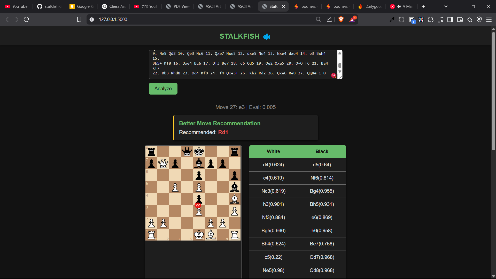

# Stalkfish‑2
A free, Flask‑powered PGN analyzer to give your chess game all the love it deserves
no Diamond subscription needed! 💋♟️

## 🚀 Quick Start
1. **Clone**  
   ```bash
   git clone https://github.com/shaadart/stalkfish-2.git
   cd stalkfish-2
   ```

2. **Install**
   ```bash
   pip install -r requirements.txt
   ```

3. **Run**  
   ```bash
   python app.py
   ```

5. **Play**  
   Open your browser at [http://127.0.0.1:5000](http://127.0.0.1:5000)

<a href="https://imgflip.com/i/9s2iq9"></a><div><a href="https://imgflip.com/memegenerator">from Imgflip Meme Generator</a></div>
## 💡 Under Development

- Live engine evaluations
- Better Move Recommendation
- UI Enhanceement  
- Move annotations  
- Opening explorer (coming soon…)


## 🤝 Contribute

Issues, ideas & PRs are welcome! 
Let’s make chess analysis free and fabulous.  
https://github.com/shaadart/stalkfish-2  

~ yours Shaad


